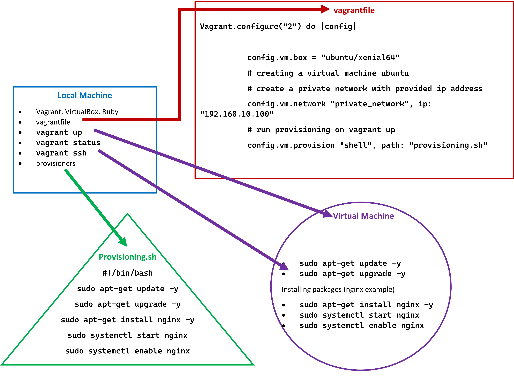

# Read all documentation thoroughly before starting.

# Starting your virtual machine:
## You can think of this as entering a remote computer with a Linux system.

1. Install VirtualBox, Vagrant and Ruby.
2. Open up GitBash (or preferred terminal).
3. Create the vagrantfile using the above code.
4. Run `vagrant up`. The virtual machine will take a few moments to start.
5. Run `vagrant status` to check that the virtual machine is running.
6. Run `vagrant ssh` to enter the virtual machine.